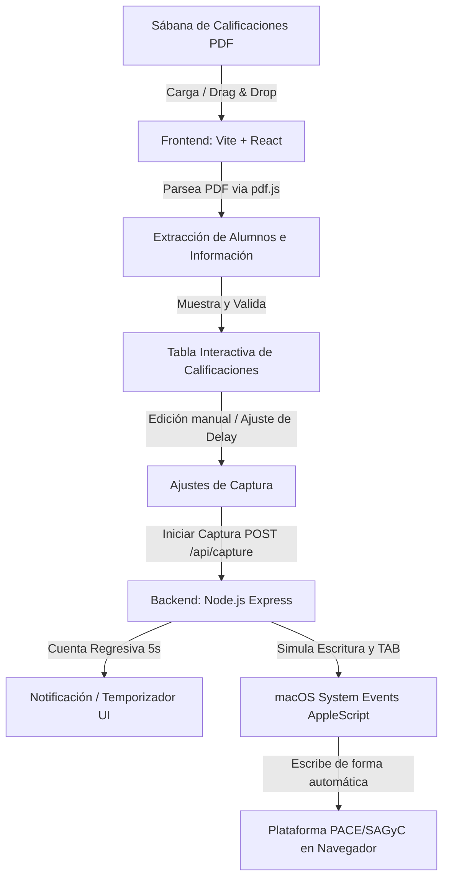

# Diseño Técnico y Funcional: PACE AutoCapture

## 1. Descripción General

**PACE AutoCapture** es una aplicación de escritorio local basada en una arquitectura web híbrida (Frontend en React + Backend en Node.js Express). Su objetivo principal es automatizar la captura manual de calificaciones finales en la plataforma oficial **PACE/SAGyC de la Dirección General del Bachillerato (DGB)**, reduciendo los tiempos de captura de los docentes y previniendo errores humanos de transcripción.

El docente carga el archivo PDF de la "Sábana de Calificaciones", la aplicación extrae de forma inteligente la columna de calificaciones finales, presenta una tabla editable para revisión, valida las notas contra reglas predefinidas y simula la secuencia física de escritura (`Calificación -> TAB -> Retardo -> Siguiente`) sobre el navegador del usuario enfocado en la plataforma oficial.

---

## 2. Objetivos y Alcance

*   **Lectura Inteligente de PDF**: Extraer nombres de alumnos, calificaciones finales y metadatos generales (Grupo, Materia, Docente, Fecha) usando `pdf.js` en el cliente.
*   **Diseño Premium (Apple/macOS Style)**: Interfaz de usuario limpia, responsiva, con glassmorphism, tarjetas redondeadas y micro-animaciones.
*   **Vista Previa e Interactividad**: Permitir la edición directa de calificaciones extraídas, filtrado por buscador, ordenación de registros y exportación (CSV y Excel/XLSX).
*   **Validación de Datos**: Identificar calificaciones reprobatorias (< 5.0), errores de rango (> 10.0), valores vacíos o no numéricos con alertas visuales claras.
*   **Inyección y Simulación de Teclado**: Simulación local de pulsaciones de teclas en macOS mediante AppleScript (`osascript`) con retardo (delay) ajustable y cuenta regresiva de 5 segundos previa.
*   **Historial de Sesiones**: Guardar localmente las sábanas de calificaciones y grupos previamente cargados para consultas posteriores.
*   **Arquitectura Extensible**: Diseñar el flujo del backend para acoplar en el futuro un navegador automatizado (Puppeteer/Playwright) que capture directamente sin intervención del docente.

---

## 3. Arquitectura del Sistema y Flujo de Datos

El sistema se estructura en dos partes principales que se ejecutan de manera local:



### 3.1. Estructura de Directorios Propuesta

```text
pace-autocapture/
├── package.json
├── README.md
├── pdf_muestras/             # Carpeta para sábanas de calificaciones de prueba
├── backend/
│   ├── server.js             # Servidor principal de Express (Puerto 3001)
│   └── services/
│       ├── captureService.js # Interfaz e implementación de inyección de teclado (AppleScript)
│       └── historyService.js # Manejo de persistencia del historial (JSON local)
└── frontend/                 # Proyecto React + TypeScript (Vite, Puerto 5173)
    ├── package.json
    ├── tailwind.config.js
    ├── index.html
    └── src/
        ├── main.tsx
        ├── index.css
        ├── App.tsx
        ├── components/       # Componentes reusables (Table, Stats, UploadCard, History)
        └── utils/            # Analizador de PDFs y algoritmos de coordenadas
```

---

## 4. Diseño de la Interfaz de Usuario (UI/UX)

La aplicación implementa los principios de diseño de macOS/Apple:
*   **Esquema de Colores**: Fondo gris ultra-claro (`#fbfbfd`), tarjetas en blanco puro (`#ffffff`) con bordes finos de separación de 1px (`#e5e5e5`) y sombras suaves.
*   **Tipografía**: Utilización del sistema de fuentes de Apple (`-apple-system`, `SF Pro Text`, `Inter`).
*   **Micro-animaciones**: Transiciones de 150ms al pasar el cursor (hover) por botones y tarjetas.
*   **Secciones Principales**:
    1.  **Panel Superior (Header)**: Título, estado del servidor y botón de historial lateral deslizante (Drawer).
    2.  **Sección de Carga (Drag & Drop Card)**: Tarjeta con bordes punteados para subir el archivo. Muestra información detectada (Materia, Grupo, Docente) a la derecha al procesar.
    3.  **Sección de Métricas y Estadísticas**: Tarjetas con Promedio, % de Aprobados, % de Reprobados y Alerta de Advertencias críticas.
    4.  **Sección de Vista Previa (Tabla)**: Buscador, botones de exportación, tabla con scroll y celdas numéricas editables. Las filas con advertencias se pintan con fondo amarillo/rojo según el error.
    5.  **Panel de Automatización**: Barra inferior con control numérico del retardo (ej. `150ms`), botón de simulación (imprime la secuencia en consola sin escribir en el sistema) y botón de captura.

---

## 5. Estrategia de Lectura de PDF (Frontend)

El procesamiento del PDF se realizará en el cliente usando `pdfjs-dist` para evitar sobrecargar el backend y hacer la app sumamente rápida.

### 5.1. Algoritmo de Extracción
1.  **Carga del Documento**: Carga del PDF en memoria en un array de bytes.
2.  **Lectura de Texto y Coordenadas**: Se recorre cada página extrayendo los ítems de texto (`getTextContent()`) que contienen el texto y su matriz de transformación (posición `x` e `y`).
3.  **Mapeo de Cabeceras**: Se detecta la línea horizontal que contiene las cabeceras principales (`ALUMNO`, `Calif. FINAL`). Se almacenan las coordenadas X de cada cabecera.
4.  **Agrupación de Datos por Fila**:
    *   Los textos cuya coordenada Y esté en el mismo rango horizontal (margen de error de +/- 2px) se consideran pertenecientes al mismo renglón.
    *   Se extrae el nombre del alumno (columna con coordenada X similar a la cabecera `ALUMNO`).
    *   Se busca el valor numérico situado en la coordenada X alineada con `Calif. FINAL`.
5.  **Extracción de Metadatos**: Se analiza la parte superior de las páginas buscando patrones como `GRUPO:`, `MATERIA:`, `DOCENTE:`.

---

## 6. Lógica de Captura y API de Inyección (Backend)

El backend de Node.js Express (puerto 3001) recibirá los datos finales listos para inyección.

### 6.1. Contrato de la API

`POST /api/capture`
*   **Cuerpo (JSON)**:
    ```json
    {
      "grades": [
        { "name": "AGUILAR REYES SOFIA", "grade": "8.5" },
        { "name": "GARCIA LOPEZ JUAN", "grade": "5.0" }
      ],
      "delayMs": 150
    }
    ```
*   **Respuesta**:
    ```json
    { "status": "success", "message": "Captura completada exitosamente" }
    ```

### 6.2. Inyección mediante AppleScript
El servicio ejecutará comandos de AppleScript utilizando el módulo de Node `child_process`. Para cada calificación en la lista:
1.  Escribe la calificación utilizando el evento de sistema de pulsación de teclas.
2.  Envía la tecla TAB (código de tecla `48`).
3.  Realiza una espera asíncrona de `delayMs`.

Ejemplo del comando AppleScript básico a ejecutar:
```bash
osascript -e 'tell application "System Events" to keystroke "8.5"' -e 'tell application "System Events" to key code 48'
```

---

## 7. Preparación para Integraciones Directas Futuras

Para permitir en el futuro una integración directa con la plataforma PACE mediante automatización de navegadores (Puppeteer, Playwright o Selenium) sin reescribir la aplicación, utilizaremos el **Patrón Estrategia (Strategy Pattern)** en el backend.

Se define una interfaz abstracta para el servicio de captura:

```typescript
interface ICaptureService {
  capture(grades: GradeEntry[], delayMs: number): Promise<CaptureResult>;
}
```

Implementaciones:
1.  `AppleScriptCaptureService` (Actual): Simula teclado físico en el navegador que el usuario tenga enfocado en su pantalla principal.
2.  `DirectBrowserCaptureService` (Futura): Levantará una instancia de navegador (Playwright/Puppeteer), iniciará sesión en PACE, localizará la tabla mediante selectores CSS, cruzará nombres y capturará de forma directa e independiente en segundo plano.

Esta abstracción permite que cambiar el método de automatización sea tan simple como modificar una línea de configuración en el archivo de inicio del backend, manteniendo el frontend en React intacto.

---

## 8. Plan de Validación y Pruebas

*   **Prueba de PDF**: Se incluirán archivos de muestra en la carpeta `pdf_muestras/` para comprobar la exactitud del parseador de sábanas.
*   **Modo Simulación**: Permite validar que el frontend genere la secuencia exacta de calificaciones antes de enviarla a inyectar al sistema operativo.
*   **Prueba de Inyección Local**: Se utilizará una hoja de cálculo local (Google Sheets o Excel) abierta en segundo plano para verificar que el script escribe los valores correctamente uno tras otro en los campos correspondientes.
