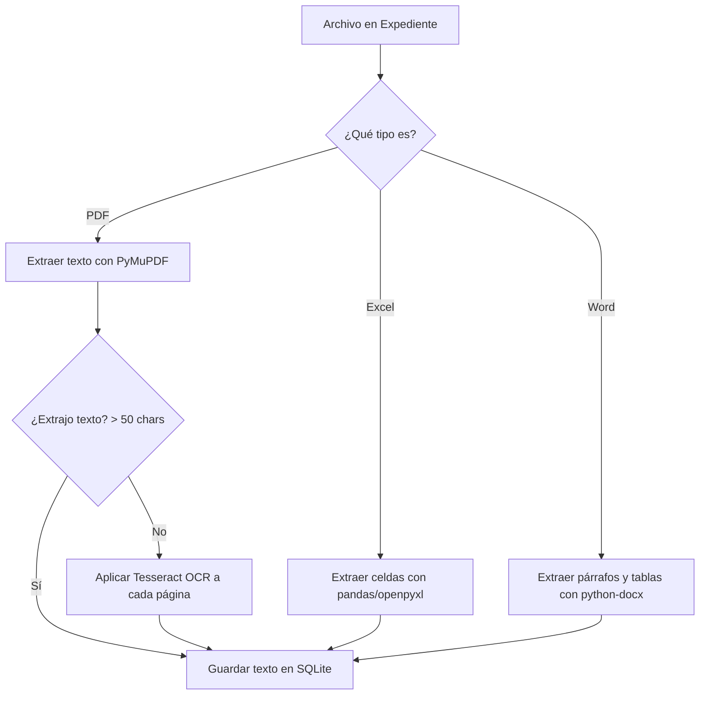

# Especificación de Diseño: Auditor de Expedientes
**Fecha:** 2026-06-24  
**Autor:** Antigravity (AI Coding Assistant)  
**Proyecto:** Auditor de Expedientes (macOS Local Web App)

---

## 1. Introducción y Objetivo

El **Auditor de Expedientes** es una aplicación de escritorio local para macOS diseñada para automatizar la revisión y auditoría documental de expedientes administrativos organizados en carpetas. Estos expedientes se sincronizan a través de Google Drive corporativo o personal a directorios locales de la Mac.

La aplicación analiza expedientes completos (estructuras de carpetas y subcarpetas), extrae y cachea el contenido de sus archivos (PDFs y Excel), y evalúa semánticamente el cumplimiento de criterios establecidos en una **Lista de Cotejo** dinámica (cargada desde Excel) mediante la **API de Google Gemini**. Finalmente, genera un Dashboard visual premium y exportaciones ejecutivas en Excel, Word y PDF.

---

## 2. Pila Tecnológica (Tech Stack)

* **Backend:** FastAPI (Python 3.12+)
* **Servidor Web Local:** Uvicorn
* **Base de Datos:** SQLite (vía SQLAlchemy)
* **Procesamiento de Documentos:**
  * PyMuPDF (`fitz`) para extracción ultra-rápida de texto en PDFs.
  * `pdfplumber` como motor secundario para tablas en PDFs.
  * `pytesseract` (Tesseract OCR) para digitalización de PDFs escaneados (imagen pura).
  * `pandas` y `openpyxl` para lectura y escritura de archivos Excel.
  * `python-docx` para generación de reportes en formato Word (`.docx`).
  * `reportlab` para generación de reportes en formato PDF (`.pdf`).
* **Integración con IA:** SDK de Google Generative AI (Modelos `gemini-2.5-flash` o `gemini-1.5-flash` con salida estructurada JSON).
* **Frontend:** HTML5, CSS Vanilla (diseño premium, soporte nativo de modo claro y oscuro, estilo glassmorphism), Bootstrap 5, DataTables.net (tablas interactivas) y Chart.js (gráficas dinámicas).
* **Entorno de Ejecución:** Entorno virtual de Python (`.venv`) y script ejecutable de macOS `.command` para inicio con doble clic.

---

## 3. Arquitectura del Sistema y Flujo de Datos

### 3.1 Estructura de Archivos del Proyecto
El proyecto se creará en un subdirectorio dedicado llamado `auditor-expedientes/` dentro del directorio de trabajo activo local `/Users/felipelopezsalazar/Developer/Proyecto_Gestion_CEB/`.

```
auditor-expedientes/
├── app/
│   ├── __init__.py
│   ├── main.py                 # Puntos de entrada FastAPI, enrutamiento
│   ├── database.py             # Configuración de SQLite y SQLAlchemy
│   ├── models.py               # Modelos/Esquemas de Base de Datos
│   ├── schemas.py              # Esquemas de validación Pydantic
│   ├── services/
│   │   ├── __init__.py
│   │   ├── parser.py           # Extractor de texto (PDF, Excel, OCR)
│   │   ├── auditor.py          # Lógica de auditoría y llamadas a Gemini API
│   │   └── reports.py          # Generador de reportes Excel, Word y PDF
│   └── templates/
│       ├── base.html           # Plantilla base HTML (estilos, navbar, temas)
│       ├── dashboard.html      # Pantilla del Dashboard
│       ├── detalle.html        # Plantilla de Detalle de Expediente
│       └── configuracion.html  # Plantilla de Configuración y Mapeo
├── static/
│   ├── css/
│   │   └── style.css           # Estilos personalizados (glassmorphism, tema oscuro)
│   └── js/
│       └── app.js              # Lógica JS del lado del cliente (gráficos, ajax)
├── requirements.txt            # Dependencias de Python
├── install.sh                  # Script de instalación para macOS
└── Auditor_Expedientes.command # Lanzador de doble clic para macOS
```

---

## 4. Diseño de Base de Datos (SQLite)

La persistencia de datos local utilizará SQLite para garantizar rapidez, portabilidad y nulo mantenimiento.

### 4.1 Esquema Físico de Tablas

#### Tabla: `configuracion`
Almacena los parámetros generales de ejecución de la herramienta.
* `id`: `INTEGER PRIMARY KEY AUTOINCREMENT`
* `ruta_expedientes`: `TEXT` (Ruta absoluta local al directorio raíz de expedientes)
* `ruta_lista_cotejo`: `TEXT` (Ruta absoluta local al archivo de Lista de Cotejo Excel)
* `mapeo_columnas`: `TEXT` (JSON serializado con el mapeo de columnas seleccionadas por el usuario, ej: `{"criterio": "Criterio", "tipo": "Tipo", "peso": "Peso", "documento_esperado": "Documento esperado"}`)
* `gemini_api_key`: `TEXT` (Clave de API opcional para invalidar la del entorno)
* `created_at`: `DATETIME DEFAULT CURRENT_TIMESTAMP`

#### Tabla: `criterios_cotejo`
Criterios dinámicos de auditoría importados del Excel de Lista de Cotejo.
* `id`: `INTEGER PRIMARY KEY AUTOINCREMENT`
* `criterio`: `TEXT`
* `tipo`: `TEXT` (Ej. Contrato, Administrativo, Pago)
* `peso`: `REAL` (Peso del criterio para el porcentaje de cumplimiento)
* `documento_esperado`: `TEXT` (Nombre del documento o patrón clave de archivo donde debe buscarse)
* `activo`: `BOOLEAN DEFAULT 1`

#### Tabla: `expedientes`
Registra las carpetas de nivel superior que representan expedientes individuales.
* `id`: `INTEGER PRIMARY KEY AUTOINCREMENT`
* `nombre_carpeta`: `TEXT` (Nombre del directorio del expediente, ej: `C. 02 R. 1637 servicio de impresión`)
* `ruta_relativa`: `TEXT` (Ruta relativa desde la raíz configurada)
* `fecha_deteccion`: `DATETIME DEFAULT CURRENT_TIMESTAMP`
* `fecha_analisis`: `DATETIME` (Nulo si aún no se ha analizado)
* `estado_analisis`: `TEXT` (`"Pendiente"`, `"Analizando"`, `"Completado"`, `"Error"`)
* `porcentaje_cumplimiento`: `REAL` (Puntaje ponderado de cumplimiento de 0.0 a 100.0)
* `resultado_global`: `TEXT` (`"Cumple"`, `"Cumple parcialmente"`, `"No cumple"`, `"Sin analizar"`)
* `error_mensaje`: `TEXT` (Detalle del error si falla el proceso)

#### Tabla: `documentos_expediente`
Detalle de archivos individuales encontrados dentro de cada expediente.
* `id`: `INTEGER PRIMARY KEY AUTOINCREMENT`
* `expediente_id`: `INTEGER` (Clave foránea a `expedientes.id`)
* `nombre_archivo`: `TEXT` (Nombre del archivo, ej: `a. oficios de autorización.pdf`)
* `ruta_relativa`: `TEXT` (Ruta relativa interna dentro de la carpeta del expediente)
* `tipo_archivo`: `TEXT` (`"pdf"`, `"xlsx"`, `"docx"`, `"otro"`)
* `tamano_bytes`: `INTEGER`
* `texto_extraido`: `TEXT` (Caché del texto completo extraído para la IA)
* `paginas_totales`: `INTEGER`

#### Tabla: `resultados_auditoria`
Evaluación por criterio para cada expediente auditado.
* `id`: `INTEGER PRIMARY KEY AUTOINCREMENT`
* `expediente_id`: `INTEGER` (Clave foránea a `expedientes.id`)
* `criterio_id`: `INTEGER` (Clave foránea a `criterios_cotejo.id`)
* `estado`: `TEXT` (`"Cumple"`, `"Cumple parcialmente"`, `"No cumple"`, `"No aplica"`)
* `observacion`: `TEXT` (Evaluación semántica generada por Gemini)
* `evidencia_documento`: `TEXT` (Nombre del archivo donde se localizó la prueba)
* `evidencia_pagina`: `INTEGER` (Número de página de la evidencia)
* `evidencia_texto`: `TEXT` (Fragmento textual exacto localizado)
* `fecha_auditoria`: `DATETIME DEFAULT CURRENT_TIMESTAMP`

---

## 5. Pipeline de Extracción de Texto (`parser.py`)

Al hacer clic en "Analizar", el sistema procesará secuencialmente cada archivo de la carpeta del expediente:



* **OCR Fallback:** En caso de que PyMuPDF no extraiga texto (PDFs escaneados sin capa OCR), se convertirá cada página a imagen temporal (usando `pdf2image` o PyMuPDF) y se pasará por Tesseract OCR.
* **Filtros de tamaño:** Archivos superiores a 20MB o no documentales (imágenes sueltas no PDF, ejecutables, archivos de sistema `.DS_Store`) se omitirán automáticamente del escaneo de texto.

---

## 6. Motor de Auditoría Semántica e Integración con Gemini

La auditoría utiliza la API oficial de Google Gemini (modelo `gemini-2.5-flash` por su gran ventana de contexto, bajo costo y velocidad).

### 6.1 Lógica de Asociación de Documentos
Antes de enviar el contenido a la IA, el motor pre-clasifica los archivos del expediente relacionándolos con la columna `documento_esperado` de la lista de cotejo. Esto se realiza buscando coincidencias textuales difusas en los nombres de archivo y subcarpetas (ej. si el documento esperado es "contrato", buscará archivos como `h. contrato.pdf` o `contrato_adhesion.pdf`).

### 6.2 Prompt Semántico Estructurado
El backend enviará a Gemini una estructura XML/JSON con las reglas e información a evaluar.
Ejemplo de Prompt:

```
Actúa como un Auditor Administrativo Gubernamental experto.
Debes evaluar el siguiente CRITERIO de auditoría en los documentos provistos.

[CRITERIO A EVALUAR]
ID: {criterio.id}
Nombre: {criterio.criterio}
Documento esperado: {criterio.documento_esperado}

[DOCUMENTOS DISPONIBLES EN EXPEDIENTE]
{Lista de archivos con su respectivo texto extraído}

[INSTRUCCIÓN]
Analiza semánticamente si el expediente cumple con el criterio evaluado.
1. No te limites a buscar palabras clave; interpreta el significado del texto.
2. Si el documento esperado no existe en el expediente, el estado debe ser "No cumple" y la observación debe reflejarlo.
3. Si el documento existe pero carece de datos clave (ej. firmas, fechas correctas, montos coincidentes con otros documentos), el estado debe ser "Cumple parcialmente" o "No cumple".
4. Devuelve obligatoriamente un JSON que coincida exactamente con este esquema:
{
  "estado": "Cumple" | "Cumple parcialmente" | "No cumple",
  "observacion": "Texto claro y profesional de la observación en español...",
  "evidencia_documento": "Nombre exacto del archivo analizado o null",
  "evidencia_pagina": Número de página (1-based) o null,
  "evidencia_texto": "Fragmento literal exacto de la prueba encontrada o null"
}
```

La llamada a la API usará la funcionalidad de **Structured Outputs** (parámetro `response_mime_type="application/json"` y un esquema Pydantic) para forzar a la IA a retornar siempre un JSON válido sin texto adicional, evitando errores de parseo.

---

## 7. Interfaz de Usuario (Frontend)

El portal web servido por FastAPI tendrá 4 vistas principales bajo un concepto visual moderno (Glassmorphism, Modo Oscuro/Claro nativo, tipografía Outfit de Google Fonts):

1. **Dashboard Principal (`dashboard.html`):**
   * Gráficos dinámicos con Chart.js (Circular para distribución de estados y de barras para porcentaje de cumplimiento por tipo de rubro).
   * Tabla dinámica (DataTables) de expedientes con filtrado instantáneo por estado, buscador global, y columna "Semáforo" (insignias verde/amarillo/rojo).
   * Acciones: Botón de "Escanear carpeta ahora" y "Analizar".
2. **Detalle del Expediente (`detalle.html`):**
   * Vista de cabecera con el porcentaje de cumplimiento general del expediente.
   * Acordeones interactivos por cada criterio evaluado.
   * Muestra del veredicto del criterio, la observación formal y una sección de **Evidencias** que expone el documento de origen, página, y el fragmento del texto exacto resaltado.
   * Botón para volver a auditar solo este expediente.
3. **Configuración de Rutas y Mapeo (`configuracion.html`):**
   * Formularios limpios para ingresar las rutas absolutas de carpetas locales y del Excel.
   * Mapeador interactivo: Cuando el usuario carga un Excel, el sistema lee los encabezados y permite seleccionar cuál corresponde a: *Criterio*, *Tipo*, *Peso* y *Documento Esperado* mediante selectores desplegables.
   * Campo de API Key de Gemini con guardado seguro.
4. **Historial de Auditorías (`historial.html`):**
   * Permite ver la evolución del cumplimiento de un mismo expediente a lo largo del tiempo (análisis previos guardados en SQLite).

---

## 8. Exportaciones y Reportes

El backend generará reportes bajo demanda en tres formatos:

1. **Consolidado en Excel (`reports.py` - pandas/openpyxl):**
   * Una hoja de cálculo donde cada fila representa un expediente y las columnas representan los criterios evaluados.
   * Celdas formateadas con colores condicionales suaves (verde para "Cumple", amarillo para "Cumple parcialmente", rojo para "No cumple").
2. **Reporte Ejecutivo en Word (`reports.py` - python-docx):**
   * Un documento formal con página de portada, tablas resumen de estadísticas del dashboard y una sección detallada por expediente que incluye solo los hallazgos con observaciones críticas ("Cumple parcialmente" y "No cumple").
3. **Reporte Ejecutivo en PDF (`reports.py` - reportlab):**
   * Un documento cerrado y estructurado que resume el estado de cumplimiento global del rubro de ingreso auditado, ideal para firmas y entrega oficial.

---

## 9. Instalación y Puesta en Marcha en macOS

### 9.1 Script de Instalación (`install.sh`)
Un script de shell que automatiza el aprovisionamiento en macOS:
1. Verifica la presencia de Python 3.12+ (si no está, indica al usuario cómo instalarlo mediante Homebrew o el instalador oficial).
2. Crea el entorno virtual local `.venv`.
3. Instala todas las dependencias listadas en `requirements.txt`.
4. Crea la base de datos SQLite inicial y ejecuta las migraciones para crear las tablas correspondientes.
5. Genera el script ejecutable de doble clic `Auditor_Expedientes.command` en el escritorio o en la raíz del proyecto.

### 9.2 Script Lanzador (`Auditor_Expedientes.command`)
Un archivo ejecutable de doble clic en macOS que:
1. Activa el entorno virtual `.venv`.
2. Ejecuta el servidor FastAPI con Uvicorn en segundo plano (`uvicorn app.main:app --port 8000`).
3. Ejecuta un comando en terminal para abrir automáticamente el navegador web predeterminado en `http://localhost:8000`.
4. Mantiene la terminal abierta con los logs para que el usuario pueda cerrarla al terminar su jornada laboral (deteniendo el servidor).
